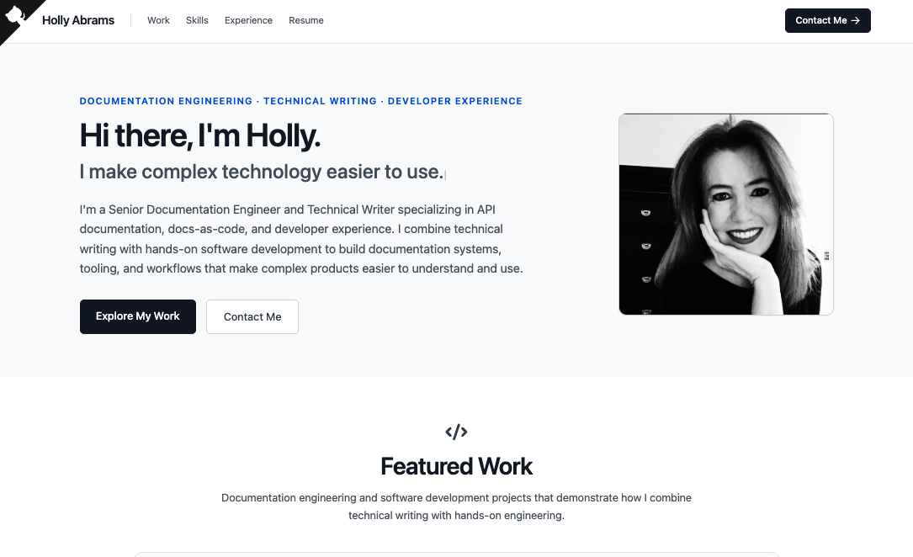

# Holly Abrams — Portfolio



## About

This repository contains the source for my personal portfolio.

I'm a Senior Documentation Engineer and Technical Writer specializing in API documentation, docs-as-code, and developer experience. My work combines technical writing with hands-on software development to build documentation systems, tooling, and workflows that make complex products easier to understand and use.

The portfolio features **DocOps**, a documentation engineering application I built to demonstrate how documentation can be designed, operated, validated, and maintained as an engineered system, along with selected full-stack development projects and my professional experience.

[View the live portfolio](https://hollyabrams.github.io/portfolio/)

## Featured Project

### DocOps — Documentation engineered.

DocOps brings together documentation engineering practices including docs-as-code, governance, API documentation, OpenAPI, automated documentation health, CI/CD, and AI-ready documentation.

[Explore DocOps](https://hollyabrams.github.io/docops/) · [View the source](https://github.com/hollyabrams/docops)

## Technologies

- React
- JavaScript
- Tailwind CSS
- CRACO
- Typed.js
- GitHub Pages

## Portfolio Highlights

- Featured documentation engineering work
- Selected full-stack development projects
- Technical skills and technologies
- Professional experience
- Responsive design
- Animated introduction
- Direct contact and professional links

## Running Locally

This project currently runs locally with Node.js 20.

```sh
npm install
npm start
```

The development server runs at `http://localhost:3000`.

## Deployment

The portfolio is hosted with GitHub Pages. Pushing changes to `main` updates the source repository but does not publish the site.

After committing and pushing changes, deploy the production build with:

```sh
npm run deploy
```

The deploy script runs the production build and publishes the `build` directory to the `gh-pages` branch.

## Connect

- [LinkedIn](https://www.linkedin.com/in/hollyabrams/)
- [GitHub](https://github.com/hollyabrams)
- [Email](mailto:holly.d.abrams@gmail.com)
